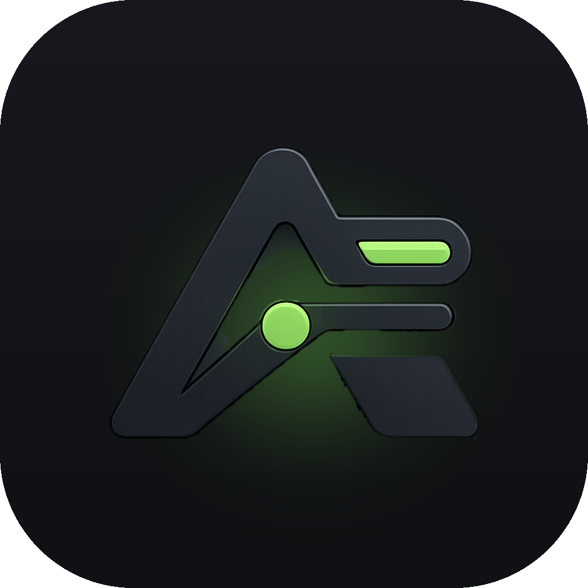

<div align="center">
  
  <h1>Aliax</h1>
  <p>Manage your accounts across AI coding tools.</p>
  <p>
    <a href="https://github.com/LandonDev/aliax-releases/releases/latest/download/Aliax-arm64.dmg">
      
    </a>
    <a href="https://github.com/LandonDev/aliax-releases/releases/latest">
      
    </a>
  </p>
  <p><sub>macOS on Apple Silicon only for now. Windows, Linux, and Intel Mac builds are not out yet.</sub></p>
</div>

Aliax is a small menu-bar app for people who run more than one account on Claude Code, Codex, or Cursor. It keeps every sign-in saved, shows how much of each rate limit you have left, and switches the live account in one click.

## What it does

- **Switch accounts in one click** — from the window or the menu bar. Aliax restarts terminal sessions in the tab they lived in, resuming the same conversation.
- **Watch limits live** — a usage bar per rate-limit window for every saved account, colored by whether you are burning faster than the window refills.
- **Instant switching** (opt-in) — routes CLI traffic through a local gateway so running sessions follow a switch without restarting.
- **Stats** — tokens, tools, models, and burn history mined from the session logs already on your machine. Nothing leaves your computer.
- **Plans and billing at a glance** — what each account costs, when it renews, and whether it is canceled.

## Install

Download the [dmg](https://github.com/LandonDev/aliax-releases/releases/latest/download/Aliax-arm64.dmg), open it, and drag Aliax to Applications. The app is signed and notarized, and updates itself from [aliax-releases](https://github.com/LandonDev/aliax-releases).

## Build from source

Needs macOS and [Bun](https://bun.sh).

```sh
bun install
bun run dev          # run with hot reload
bun run install-app  # build and install to /Applications
```

## How it handles your credentials

Sign-ins are stored in the macOS Keychain, encrypted with Electron's safeStorage. Nothing is written to disk in plaintext and nothing is sent anywhere except to the providers themselves.

## License

Open source under the [MIT license](LICENSE).
